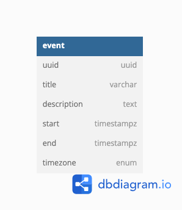

# Kumojin Event Manager / Gestionnaire d'Événement Kumojin

## Database /  Base de Données
### Database Architecture Diagram / Architecture de la Base de Données


### Database Connection / Connexion à la Base de Données

The Database is a PostgreSQL database which is configured in ```/src/config```. I've added environment variables in the ```./development.env``` file to simplify connection in this test project. Note that no ```.env``` should be committed to repository in a real project.

La base de données est une base de données PostgreSQL qui est configurée dans ```/src/config```. J'ai ajouté des variables d'environnement dans le fichier ```./development.env``` pour simplifier la connexion dans ce projet de test. Notez qu'aucun fichier ```.env``` ne doit ajouté au repository dans un vrai projet.

The ```.development.env``` connection parameters are as follows / Les paramètres de connexion ```.development.env``` sont les suivants:

```bash
DB_HOST=127.0.0.1
DB_PORT=5432
DB_USERNAME=postgres
DB_PASSWORD=
DB_NAME=kmj-test
```

## Client / Client
### Installation / Installation

```bash
$ npm install
```

### Launching Client / Lancement du Client

The client is configured to launch on port ```3000```.

Le client est configuré au port  ```3000```.

```bash
$ npm start 
```

### Running Client Tests / Exécution des Tests du Client

```bash
npm test
```


## Server / Serveur

### Installation / Installation

```bash
$ npm install
```

### Launching Server / Lancement du Serveur

The server is configured to launch on port ```8000```.

Le server est configuré au port  ```8000```.

```bash
# development
$ npm run start

# watch mode
$ npm run start:dev

# production mode
$ npm run start:prod
```

### Running Server Tests / Exécution des Tests du Serveur

```bash
# unit tests
$ npm run test

# e2e tests
$ npm run test:e2e

# test coverage
$ npm run test:cov
```

### Swagger 

Swagger docs are accessible at ```/api/v1.0/docs``` once the server is launched.

La documentation swagger peut être accèdé à ```/api/v1.0/docs```, une fois que le serveur est lancé.

Locally / Localement: http://localhost:8000/api/v1.0/docs.

## Notes / Annotations 

### Décision sur la proprieté ```timezone```

J'ai fais la décision d'inclure une proprieté enum ```timezone``` même si le fuseau horaire de l'événement est déjà accessible à partir du ```start``` et ```end``` qui sont du type ```timestampz```. L'idée était de permettre à l'utilisateur de préciser le fuseau horaire de l'événement indépendament de sa position géographique actuelle dans un format lisible. L'enum peut facilement être modifié et formatté comme les fuseaux horaire de Google Calendar:


Lors de ce modification, ```timestampz``` devrait être converti en ```timestamp```.

### Obstacles par rapport aux Test Unitaires avec React et Redux

Les tests du projet client en React souffrent d'une paucité de tests unitaires. J'ai rencontré des difficulté avec l'intégration entre la bibliothèque de test ```testing-library/react``` et les dépendances de ```react-redux```. À cause des contraintes de temps, j'ai du gardé l'ampleur de ces tests au moindre possible mais dans le cas contraire, j'aurais augmenté l'étendu des fonctionalités testés.


